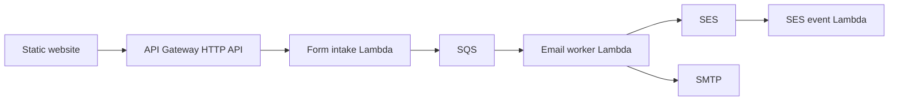

# Static Website Email Service

A reusable, multi-tenant email service for static websites.

Static frontends cannot securely store API secrets. This service treats browser JavaScript as untrusted: the frontend submits only a public site ID, form ID, Turnstile token, and form fields. Recipients, senders, templates, providers, SES identities, and SMTP credentials come from backend configuration.

## Architecture



Main AWS services:

- API Gateway HTTP API
- Lambda
- SQS + DLQ
- DynamoDB
- SES
- SSM Parameter Store for Turnstile and SMTP secrets
- CloudWatch logs and DLQ alarm

## Repository Layout

```text
.
|- src/common/               Shared domain, adapters, and utilities
|- src/form_intake_lambda/   API Gateway Lambda entrypoint
|- src/email_worker_lambda/  SQS worker Lambda entrypoint
|- src/email_events_lambda/  SES event Lambda entrypoint
|- terraform/                Terraform root and modules
|- docs/                     Architecture and operations
|- tests/                    Unit tests and fixtures
|- examples/static-site/     Plain static frontend example
|- examples/demo-tenant.json Safe sample tenant configuration
|- scripts/                  Build helpers
|- .github/workflows/        CI
|- Makefile
`- pyproject.toml
```

## Prerequisites

- Python 3.12+
- Terraform 1.15.x
- GNU Make, or run the commands from the Makefile manually
- AWS credentials only for Terraform plan/apply or real Lambda execution

## Local Setup

```sh
make install
make check
make build
```

Useful commands:

```sh
make lint
make typecheck
make test
make terraform-fmt
make terraform-validate
```

## Frontend Integration

See [examples/static-site](examples/static-site). Public JavaScript may contain the API URL, public site identifier, and Turnstile site key. It must not contain destination addresses, SMTP credentials, SES credentials, template IDs, or provider choices.

## Adding Configuration

The current MVP expects configuration in DynamoDB using the key model documented in [docs/architecture/overview.md](docs/architecture/overview.md). A safe example lives at [examples/demo-tenant.json](examples/demo-tenant.json). Admin seeding scripts are intentionally not built yet.

## SES

Use a verified domain or email identity, DKIM, SPF, DMARC, and SES production access before production traffic. Website visitor addresses should be used as `Reply-To`, never as the `From` identity.

## SMTP

SMTP is supported through the generic SMTP provider. Store credentials in SSM SecureString parameters and reference them from backend provider configuration. Do not place SMTP passwords in Terraform variables, DynamoDB plaintext, SQS messages, or frontend code.

## Deployment

Terraform uses one root module with website-based values:

```text
terraform/
`- values/
   `- demo-hotel/
      `- ap-south-1/
         |- book.backend.hcl
         |- book.tfvars
         |- www.backend.hcl
         `- www.tfvars
```

First deployment still needs manual prerequisites: remote state bucket/table, SES identity, Cloudflare API token if managing Turnstile, and deployment review. Do not run `terraform apply` until a plan has been inspected.

Use `make terraform-plan WEBSITE=demo-hotel REGION=ap-south-1 SUBDOMAIN=www` so the path selects the right tfvars/backend files and the same values are passed to Terraform inline.

## Monitoring

The Terraform MVP creates CloudWatch log groups and a DLQ alarm. Application logs should use request IDs and provider message IDs and should avoid full form payloads and email bodies.

## Limitations

- No admin CLI/dashboard yet.
- Quotas are modeled but not fully persisted/enforced in DynamoDB yet.
- Terraform can create the Turnstile widget and store its generated secret in SSM. The secret will also exist in Terraform state.
- Terraform IAM is intentionally compact and should be tightened further before production.
- No deployment has been run.
