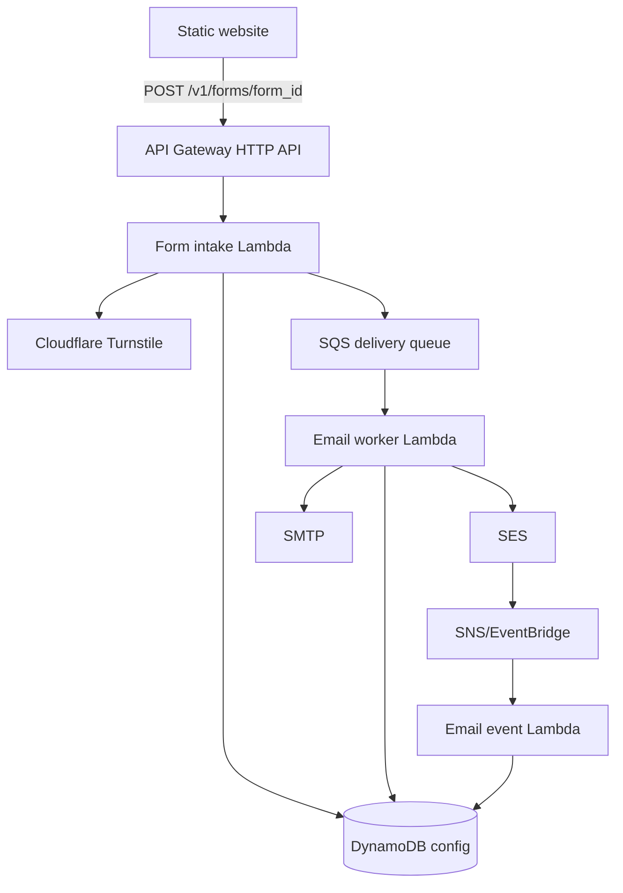

# Architecture Overview

## Problem

Static websites need a safe way to submit contact, booking, and quote forms without putting email credentials or delivery rules in public JavaScript.

## Goals

- Accept public form submissions from configured sites.
- Keep recipients, senders, templates, and provider credentials in trusted backend configuration.
- Send email asynchronously through SES first, with SMTP fallback where needed.
- Keep operating cost low with pay-per-request AWS services.
- Support multiple tenants, sites, forms, providers, and templates in one deployment.

## Non-Goals

- Web admin dashboard.
- RDS, ECS, EKS, Redis, NAT Gateway, ALB, or always-on compute.
- Browser-side API secrets.
- Guaranteed protection from forged `Origin` headers without CAPTCHA/quotas.

## Components



## Request Flow

The intake Lambda validates body size, JSON shape, site/form configuration, allowed origin, Turnstile, honeypot fields, and field schema. It creates a versioned SQS job containing only validated form values and correlation IDs.

## Email Flow

The worker reloads trusted configuration, renders the configured template, builds a message using backend-owned sender and recipient values, selects the configured provider, sends, and records status.

## SES Event Flow

SES delivery, bounce, and complaint events are parsed by the event Lambda and stored as delivery events. Complaint and hard-bounce suppression can be expanded from this path.

## Multi-Tenant Model

```text
Tenant
  └── Site
       └── Form
            ├── Field definitions
            ├── Template reference
            └── Provider reference
```

## Trust Boundaries

Public JavaScript is untrusted. It may provide only public values such as `site_id`, `form_id`, Turnstile token, and form fields. It must never provide destination email, sender, provider credentials, SES identity, arbitrary template, or arbitrary subject.

`Origin` and `Referer` are useful signals, not authentication.

## Security

- Server-side Turnstile verification.
- Allowed-origin checks.
- Honeypot support.
- Field allow-list validation.
- Header injection rejection.
- Template escaping by default.
- SQS jobs exclude credentials and delivery configuration.
- SMTP credentials read from SSM SecureString by reference.

## Data Retention

The service should retain only metadata needed for operations, abuse investigation, and delivery status. Full message bodies should not be logged and do not need long-term storage.

## Scaling

API Gateway, Lambda, SQS, DynamoDB on-demand, and SES scale without always-on infrastructure. SQS buffers bursts and isolates public intake from provider delays.

## Cost

The default architecture uses scale-to-zero services. Avoid NAT Gateway, VPC Lambda, WAF, Secrets Manager per-form secrets, and custom metrics unless there is a concrete need.

## Failure Handling

Validation failures return 4xx and are not queued. Worker failures use SQS retries and DLQ. The worker uses partial batch failures so successful messages are not retried.
